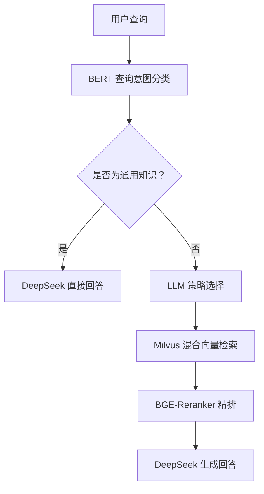

<p align="center">
  <h2 align="center">🍀 EduRAG — 教育领域智能问答系统</h2>
  <p align="center">
    面向教育场景的 <b>RAG（检索增强生成）</b> 智能问答系统，融合关键词匹配与语义检索双引擎，
    支持多种文档格式、自动查询分类、智能策略选择与流式 LLM 答案生成。
  </p>
</p>

<p align="center">
  
  
  
  
  
  
</p>

---

## 📖 项目简介

EduRAG 是一个面向教育领域的智能问答系统，基于 RAG（Retrieval-Augmented Generation）架构，结合 **BM25 关键词匹配** 和 **语义向量检索** 双引擎，为用户提供精准的智能问答体验。

### 核心能力

- **双引擎检索**：BM25 关键词匹配 + BGE-M3 语义向量检索，兼顾精准度与召回率
- **智能策略选择**：LLM 自动选择最佳检索策略（直接检索 / HyDE / 子查询 / 回溯问题）
- **流式输出**：SSE Server-Sent Events，逐 Token 流式响应，实时渲染
- **多轮对话**：对话历史持久化到 MySQL，支持会话管理
- **多学科支持**：AI、Java、测试、运维、大数据等多学科知识库
- **多格式支持**：PDF、Markdown、TXT 文档自动处理与向量化

---

## 系统架构

项目采用双引擎 + 智能路由架构，核心流程如下：



**双引擎机制：**

| 引擎 | 模块 | 说明 |
|------|------|------|
| **关键词引擎** | mysql_qa/ | BM25 关键词匹配 + Redis 缓存 + MySQL 问答库 |
| **语义引擎** | rag_qa/ | BERT 分类 + 4 种策略 + Milvus 混合检索 + LLM 生成 |

当关键词引擎的 BM25 匹配置信度足够高时，直接返回 MySQL 中的答案；否则自动降级到语义引擎进行 RAG 检索和 LLM 生成。所有对话记录持久化到 MySQL。


## ✨ 功能特性

| 特性 | 说明 |
|------|------|
| **📄 多格式文档处理** | 支持 PDF、Markdown、TXT 格式，自动 OCR 识别图片文字 |
| **🔍 双引擎检索** | BM25 关键词精准匹配 + BGE-M3 语义向量混合检索 |
| **🧠 智能分类** | BERT 模型自动判断「通用知识」与「专业咨询」，避免无效检索 |
| **🎯 策略选择** | LLM 从 4 种检索策略中选择最优方案：直接 / HyDE / 子查询 / 回溯 |
| **⚡ 实时流式输出** | SSE 技术逐 Token 返回答案，前端逐字渲染 |
| **💬 对话管理** | 多会话支持，对话历史持久化，刷新不丢失 |
| **📊 来源引用** | 显示回答引用的检索来源文档 |
| **🔄 跨学科查询** | 支持按学科过滤，灵活切换知识范围 |

---

## 🚀 快速开始

### 环境要求

- Python 3.9+
- MySQL 8.0+
- Redis 7.0+
- 至少 8GB 可用内存（用于模型推理）

### 1. 克隆项目

`ash
git clone https://github.com/pao030104/Educational_RAG_System.git
cd Educational_RAG_System
`

### 2. 安装依赖

推荐使用 [uv](https://github.com/astral-sh/uv) 作为包管理器：

`ash
# 安装 uv
pip install uv

# 创建虚拟环境并安装依赖
uv sync
`

### 3. 配置服务

`ash
# 复制配置模板
cp config.ini.example config.ini

# 编辑 config.ini，填入真实配置
# - MySQL 连接信息
# - Redis 连接信息（可选）
# - LLM API Key（支持 DeepSeek / Qwen 等 OpenAI 兼容 API）
`

### 4. 数据准备

`ash
# 导入 MySQL 知识库数据（包含预置的学科问答对）
mysql -u root -p subject_kg < data/subject_kg.sql

# 文档处理与向量化（将 PDF/MD 文档转换为向量存入 Milvus）
uv run python rag_qa/rag_main.py --data_processing --data_dir rag_qa/data
`

### 5. 启动服务

`ash
# 确保 MySQL 和 Redis 已启动

# 启动 Web 服务
uv run uvicorn app:app --host 127.0.0.1 --port 8001
`

打开浏览器访问 **http://127.0.0.1:8001**

---

## ⚙️ 配置说明

### 配置文件

系统通过 config.ini 集中管理配置，支持环境变量覆盖：

`ini
[mysql]
host = localhost
user = root
password = your_mysql_password
database = subject_kg

[redis]
host = localhost
port = 6379

[llm]
model_name = deepseek-chat
dashscope_api_key = your_api_key_here
dashscope_base_url = https://api.deepseek.com

[milvus]
uri = ./milvus_lite.db

[retrieval]
parent_chunk_size = 1200
child_chunk_size = 300
chunk_overlap = 50
retrieval_k = 5
candidate_m = 2
`

### 环境变量覆盖

所有配置项均可通过同名环境变量覆盖（优先级更高）：

`ash
export DASHSCOPE_API_KEY=sk-your-key
export MYSQL_PASSWORD=secure_password
`

### LLM 切换

支持任何 OpenAI API 兼容的后端。修改 config.ini 中的 dashscope_base_url 和 dashscope_api_key 即可切换：

| 服务商 | Base URL | 模型 |
|--------|----------|------|
| **DeepSeek** | https://api.deepseek.com | deepseek-chat |
| **阿里云通义千问** | https://dashscope.aliyuncs.com/compatible-mode/v1 | qwen-plus |
| **vLLM 本地** | http://localhost:8000/v1 | 自定义 |

---

## 📡 API 文档

### 智能问答

`http
POST /api/chat
Content-Type: application/json

{
  "query": "AI学科有哪些课程？",
  "source_filter": "ai",
  "session_id": "optional-session-uuid"
}
`

响应为 SSE（Server-Sent Events）流式输出：

`
data: {token: AI, session_id: ..., done: false}
data: {token: 课, session_id: ..., done: false}
data: {token: 程, session_id: ..., done: false}
data: {token: ", session_id: ..., done: true, sources: [ai]}
`

### 对话历史

`http
GET  /api/history/{session_id}       # 获取历史
DELETE /api/history/{session_id}      # 清空历史
`

### 其他接口

`http
GET /api/sources                     # 获取学科列表
GET /api/conversations               # 获取所有会话
`

---

## 🔍 检索策略

系统内置四种检索策略，由 LLM 根据查询特征自动选择：

| 策略 | 原理 | 适用场景 |
|------|------|----------|
| **直接检索** | 原始查询直接检索 | 查询意图明确，需特定信息 |
| **HyDE** | LLM 生成假设答案 → 用假设答案检索 | 查询较抽象，原始查询与文档语义不匹配 |
| **子查询检索** | LLM 拆分为 N 个子查询 → 分别检索 → 合并去重 | 查询涉及多方面比较 |
| **回溯问题检索** | LLM 简化为基础问题 → 用简化问题检索 | 查询过于具体、细节太多 |

---

## 🛠️ 技术栈

| 层次 | 技术选型 |
|------|----------|
| **LLM** | DeepSeek / Qwen（OpenAI 兼容 API）|
| **嵌入模型** | BGE-M3 (BAAI) — 1024维稠密 + 稀疏双路向量 |
| **重排序模型** | BGE-Reranker-Large (BAAI) — Cross-Encoder 精排 |
| **查询分类** | bert-base-chinese 微调 — 二分类（通用/专业）|
| **向量数据库** | Milvus Lite — IVF_FLAT（稠密）+ SPARSE_INVERTED_INDEX（稀疏）|
| **关键词检索** | BM25 + jieba 中文分词 |
| **缓存** | Redis — 查询缓存 |
| **关系数据库** | MySQL — 问答对 + 对话历史 |
| **文档处理** | PyMuPDF、python-docx、OCR、TextLoader |
| **文本分割** | ChineseRecursiveTextSplitter、MarkdownTextSplitter、语义分割 |
| **深度学习** | PyTorch、Transformers、Sentence-Transformers、FlagEmbedding |
| **Web框架** | FastAPI + SSE 流式输出 |

---

## 项目结构

```
Educational_RAG_System/
├── app.py                   # FastAPI Web 入口（SSE 流式 API）
├── main.py                  # IntegratedQASystem 双引擎问答系统
├── config.ini.example       # 配置模板
├── pyproject.toml           # 依赖管理
├── start.bat                # Windows 一键启动脚本
│
├── base/                    # 基础组件
│   ├── config.py            # 配置管理（环境变量覆盖）
│   └── logger.py            # 日志系统
│
├── mysql_qa/                # BM25 关键词引擎
│   ├── db/
│   │   └── mysql_client.py  # MySQL 客户端
│   ├── cache/
│   │   └── redis_client.py  # Redis 缓存
│   └── retrieval/
│       └── bm25_search.py   # BM25 检索
│
├── rag_qa/                  # RAG 语义引擎
│   ├── core/
│   │   ├── vector_store.py       # Milvus 混合检索
│   │   ├── rag_system.py         # RAG 流程编排
│   │   ├── query_classifier.py   # BERT 查询分类
│   │   ├── strategy_selector.py  # LLM 策略选择
│   │   └── document_processor.py # 文档处理
│   ├── edu_text_spliter/    # 文本分割器
│   ├── data/                # 知识库文档
│   └── rag_main.py          # RAG 子系统入口
│
├── static/                  # 前端页面
│   └── index.html           # 对话界面
│
└── logs/                    # 日志（.gitignore 排除）
```

## ❓ 常见问题

### Q: 首次运行很慢？
首次运行会自动下载多个模型（BERT ~400MB、BGE-M3 ~2.2GB、BGE-Reranker ~2.1GB、文档分割 ~400MB），下载后缓存，后续启动秒开。

### Q: 可以不用 MySQL/Redis 吗？
可以。仅运行 RAG 子系统：uv run python rag_qa/rag_main.py。BM25 关键词匹配和对话历史功能需要 MySQL；性能优化和查询缓存需要 Redis。

### Q: 如何添加新的学科？
1. 修改 config.ini 的 valid_source 列表
2. 创建对应数据目录 
rag_qa/data/{学科}_data/
3. 放入文档文件
4. 重新运行数据处理

### Q: 支持其他 LLM 吗？
支持任何 OpenAI API 兼容的后端。修改 config.ini 中的 dashscope_base_url 和 dashscope_api_key 即可切换。

---

## 📄 许可证

本项目基于 MIT 许可证开源。

---

## 👤 作者

**pao030104** — [@pao030104](https://github.com/pao030104)


---
